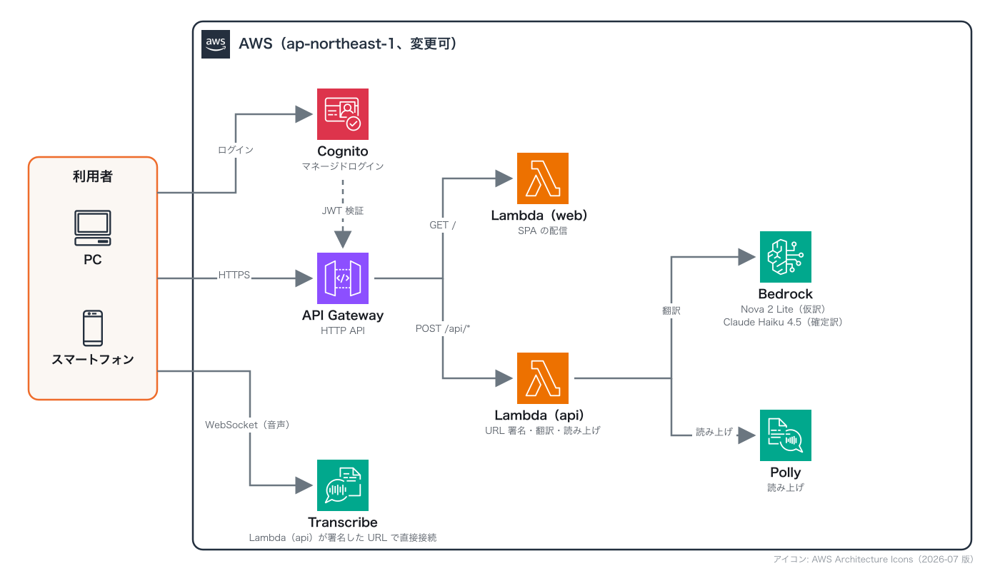

# realtime-interpreter

ブラウザで使うリアルタイム翻訳アプリです。AWS のサーバーレスのサービスだけで動きます。
Amazon Transcribe で音声を文字起こしし、話している途中の文を Amazon Nova 2 Lite で仮訳し、
文が確定したら Claude Haiku 4.5 が直前の文脈を踏まえて訳し直します。訳文は長押しで Amazon Polly が読み上げます。

A real-time interpretation web app on AWS serverless: Amazon Transcribe streaming, Amazon Bedrock
(Nova 2 Lite for drafts, Claude Haiku 4.5 for context-aware final translations) and Amazon Polly.

## 機能

- 音声入力：PC はマイクと PC の音声を混ぜて使える。PC の音声は、Chrome・Edge の画面共有で「タブ」（そのタブの音声）か「ウィンドウ」（システムの音声）を選んで取り込む。スマートフォンはマイクのみ
- 仮訳と確定訳：話している途中の文は Nova 2 Lite で仮訳を出し、確定した文は Haiku 4.5 が直前 10 文を踏まえて訳す
- 過去の訳の修正：新しい文から前の訳の誤り（文の途中で区切られた箇所、技術用語を普通の単語として訳した箇所など）がわかると、Haiku 4.5 がその訳も直す。直した訳は点線の下線とハイライトで示す
- 言語：東京リージョンの Transcribe がストリーミングに対応している 54 言語すべて（`shared/languages.ts`）。どの 2 言語の組み合わせでも翻訳できる。アラビア語など右から左に書く言語も表示できる
- 翻訳の向き：ヘッダーのボタンで切り替える。既定は英語（米国）→ 日本語
- 表示：既定は訳文のみ。「原文」ボタンで、上 1/3 に原文、下 2/3 に訳文を表示する
- 読み上げ：確定した訳文を長押しすると、発言した人の性別の声で読み上げる。Polly に声がある 35 言語は Polly（ニューラル音声を優先）を使い、声がない言語や、Polly に男性の声がない言語の男性の声は、ブラウザの読み上げ機能（`speechSynthesis`）を使う
- 性別：設定で「自分の性別」と「相手の性別」を選べる（既定はどちらも女性）。話し手や聞き手の性別で語形が変わる言語（フランス語の fatigué／fatiguée、タイ語の ครับ／ค่ะ など）は、それに合わせて訳し分ける
- 翻訳の前提：初期値は「AWS イベントの参加者向け。AWS のサービス名・技術用語・ビジネス用語は無理に訳さず英字かカタカナで。原文に忠実に簡潔に」。設定で書き換えられる
- 再接続：ネットワークが切れたり Wi-Fi とモバイル回線が切り替わったりしても、自動で再接続する。切断中の音声は最大 15 秒ぶんを保持し、再接続後に送る
- 保存しない：設定はタブを開いている間だけ有効（`sessionStorage`）。文字起こしと訳文はどこにも保存しない

## アーキテクチャ



| 要素 | 役割 |
|---|---|
| API Gateway（HTTP API） | 入口を 1 つにまとめる。`GET /` は SPA、`POST /api/{op}` は Cognito の JWT を検証してから API 用の Lambda へ渡す |
| Lambda `web` | Vite でビルドした SPA をパッケージに同梱して返す。CSP などのセキュリティヘッダーを付ける。AWS の権限は持たない |
| Lambda `api` | `transcribe-url`（Transcribe の署名付き WebSocket URL。有効期限 30 秒）、`translate`（`draft` / `final`）、`speak`（Polly） |
| Transcribe | ブラウザが WebSocket で直接つなぐ。音声は Lambda を通らない |
| Cognito | マネージドログイン。既定ではユーザーを管理者が作る。SPA は認可コード + PKCE でトークンを得る |

S3 と CloudFront は使いません。S3 の静的ウェブサイトホスティングは HTTP でしか配信できず、マイク（`getUserMedia`）は HTTPS でないと使えないためです。SPA と API を同じ API Gateway から配信するので、CORS の設定も要りません。

### モデル

| 用途 | 既定のモデル ID（東京） | 使い方 |
|---|---|---|
| 確定前の仮訳 | `jp.amazon.nova-2-lite-v1:0` | 700 ms に 1 回まで、同時に 1 リクエストまでに間引いて呼ぶ |
| 確定後の翻訳 | `jp.anthropic.claude-haiku-4-5-20251001-v1:0` | 直前 10 文を渡し、ツール呼び出しで `{translation, revisions[]}` を返させる |

推論プロファイルは、デプロイ先のリージョンから自動で選びます（東京・大阪は `jp.`、`us-*` は `us.`、`eu-*` は `eu.`、それ以外は `global.`）。`jp.` の推論プロファイルは、推論を日本国内のリージョンで処理します。

## デプロイ

必要なもの：Node.js 22.12 以上、AWS CLI、AWS アカウント。

```bash
npm install
# npx cdk bootstrap      # そのアカウント・リージョンで CDK を初めて使うときだけ実行する
npm run deploy           # 東京（ap-northeast-1）
# npm run deploy -- -c region=us-west-2   # リージョンを変えるときは、上の行の代わりにこちら
```

`cdk deploy` を直接実行しても構いません。SPA のビルドは Lambda のパッケージを作る処理の中で行います。
リージョンを変えたときは、`cdk bootstrap` も `-c region=...` をつけて（または `AWS_REGION` を設定して）そのリージョンで実行します。ブートストラップ済みの環境で再実行すると、実行ロールの権限などを既定の設定で上書きすることがあるので、必要なときだけ実行してください。

Amazon Bedrock では、デプロイの前に次を済ませておきます。

- Anthropic のモデルを初めて使うアカウントは、Bedrock コンソールのモデルカタログで Claude のモデルを開き、利用目的（ユースケース）のフォームを提出する
- Anthropic のモデルを初めて呼ぶときには AWS Marketplace の権限が要る。Lambda のロールにはこの権限を付けていないので、管理者の権限で一度呼んでおく（例：`aws bedrock-runtime converse --model-id jp.anthropic.claude-haiku-4-5-20251001-v1:0 --messages '[{"role":"user","content":[{"text":"hi"}]}]'`）
- デプロイ先のリージョンで、上の表のモデル ID（推論プロファイル）が使えることを確認する

### ユーザーの作成

既定ではセルフサインアップを無効にしているので、ユーザーは管理者が作ります。

1. AWS マネジメントコンソールで Amazon Cognito を開き、出力の `UserPoolId` のユーザープールを選ぶ
2. 「ユーザー」→「ユーザーを作成」で、招待メッセージを「E メールで送信」、パスワードを「パスワードの生成」にし、メールアドレスを入れて「E メールアドレスを検証済みとしてマークする」をオンにして作成する
3. アプリの URL と仮パスワードが入った招待メールが届くので、初回ログイン時に新しいパスワードを設定してもらう

CLI では `aws cognito-idp admin-create-user --user-pool-id <UserPoolId> --username <メールアドレス> --user-attributes Name=email,Value=<メールアドレス> Name=email_verified,Value=true` で作れます。

### パラメータ（`-c key=value`）

| キー | 既定値 | 内容 |
|---|---|---|
| `region` | `ap-northeast-1` | デプロイ先。`CDK_DEPLOY_REGION` や `AWS_REGION` でも指定できる |
| `stackName` | `RealtimeInterpreter` | スタック名 |
| `draftModelId` / `finalModelId` | 上の表 | モデル ID を明示するとき |
| `selfSignUp` | `false` | `true` でセルフサインアップ（URL を知っている人が自分で登録できる）を許可する |
| `throttleRate` / `throttleBurst` | `20` / `40` | API 全体のスロットリング（リクエスト/秒） |
| `domainPrefix` | 自動 | Cognito ドメインの接頭辞 |

削除は `npm run destroy` です（リージョンを変えてデプロイした場合は `npm run destroy -- -c region=...`）。ユーザープールも削除されます。

## コスト

常時稼働のリソースがなく、すべて使った分だけの課金なので、使っていない間の費用はほぼ 0 です。1 時間話し続けたときの目安は約 $2.2 です（2026 年 9 月時点、東京リージョン）。

| 項目 | 単価 | 1 時間の目安 |
|---|---|---|
| Transcribe ストリーミング | $0.0001667/秒 | $0.60 |
| Haiku 4.5（確定訳） | 入力 $1、出力 $5（100 万トークンあたり、Anthropic の定価） | $1.0 |
| Nova 2 Lite（仮訳） | 入力 $0.396、出力 $3.311（100 万トークンあたり） | $0.56 |
| Lambda、API Gateway、Cognito、Polly | — | 数セント |

1 時間の目安は、確定訳を 1 時間に 600 回（6 秒に 1 文）と仮定し、試用時の CloudWatch の実測値（確定訳 1 回あたり入力約 1,240・出力約 80 トークン、仮訳 1 回あたり入力約 310・出力約 26 トークン、仮訳の回数は確定訳の約 4.5 倍）から計算しています。`jp.` の推論プロファイルで Haiku 4.5 の単価に割増があるかは確認していません。

仮訳は設定でオフにできます。Transcribe は無音の間も課金されるので、10 分間なにも認識しなければ自動で停止します（オフラインや再接続中の時間は数えません）。

## セキュリティ

- API は Cognito の JWT がないと呼べない。認証なしで返すのは SPA の配信だけ
- 既定ではセルフサインアップを無効にし、管理者が作ったユーザーだけが使える。`-c selfSignUp=true` で許可すると、URL を知っている誰でも登録して Transcribe と Bedrock を使えるようになる（Transcribe の同時接続の上限は、既定でアカウント全体で 25 本）。許可する場合は AWS Budgets のアラートも設定する
- Lambda の権限は、使う 2 つのモデル（推論プロファイルとその基盤モデル）への `bedrock:InvokeModel`、`transcribe:StartStreamTranscriptionWebSocket`、`polly:SynthesizeSpeech` だけ
- ブラウザに AWS の認証情報を渡さない（Cognito の ID プールを使わない）。Transcribe の URL は Lambda のロールで署名し、有効期限を 30 秒にしている。発行の直後に接続するので、漏れた URL で別の接続を開かれる余地を小さくできる
- ログアウトするとリフレッシュトークンを取り消す（`/oauth2/revoke`）
- 入力の長さの上限（本文 2,000 文字、文脈 10 文）と API のスロットリングで、Bedrock の使いすぎを抑える
- CSP（`script-src 'self'`、接続先は自分のドメイン・Cognito・Transcribe だけ）、HSTS、`Referrer-Policy: no-referrer` を付ける
- 文字起こしと訳文の本文はログに出さない（エラーの種類だけを出す）。CloudWatch Logs の保持期間は 1 週間

## ローカル開発

```bash
AWS_PROFILE=your-profile npm run dev
```

Vite の開発サーバーが、`lambda/api.ts` を手元の AWS 認証情報で直接呼びます（ログインは省略します）。
開発サーバーでは、ブラウザのコンソールから `__devFeed(resultId, text, partial)` を呼ぶと、マイクを使わずに文字起こしの結果を流し込めます。

## 制限

- PC の音声は、Chromium 系ブラウザ（Chrome、Edge）の画面共有でしか取れない。共有ダイアログで「タブ」を選んで「タブの音声も共有」をオンにすると、そのタブの音声が入る（別ウィンドウのタブも選べる）。「ウィンドウ」を選んで「システムの音声を含めて共有する」をオンにすると、PC 全体の音声が入る（Safari など Chrome 以外のアプリで再生している音声も取れる。macOS の Chrome で確認。「画面全体」の共有では音声を取れなかった）。Safari と Firefox でこのアプリを開いた場合は画面共有で音声を取れないので、マイクのみになる
- ブラウザを問わず PC の音声を使いたいときは、仮想オーディオデバイス（Mac の BlackHole、Windows の VB-CABLE など）に PC の出力を流し、設定の「入力デバイス」でそれを選ぶ
- マイクと PC の音声を同時に使うと、スピーカーの音をマイクが拾い、同じ発言を二重に文字起こしすることがある。ヘッドホンを使うか、入力を「PC の音声のみ」にする
- 読み上げ中は、その音声を文字起こししないよう入力を無音にする
- ブラウザの読み上げ機能は声の性別を返さないので、声の名前から推定している。ブラウザや OS によっては外れる
- 言語の一覧と Polly の声の割り当ては、東京リージョンで確認したもの。ほかのリージョンでは Polly の声が使えないことがあり、その場合はブラウザの読み上げ機能で読む
- Cognito が送るメール（招待、パスワードの再設定）は 1 日 50 通まで。それ以上必要なら Amazon SES を設定する

## ライセンス

MIT
