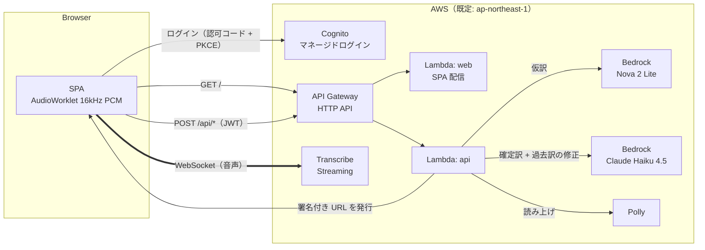

# simul-interpreter

AWS のサーバーレスだけで動く、ブラウザ向けのリアルタイム同時通訳アプリです。
Amazon Transcribe で音声をストリーミングで文字起こしし、確定前は Amazon Nova 2 Lite、
確定後は Claude Haiku 4.5（Amazon Bedrock）で翻訳します。翻訳文は長押しで Amazon Polly が読み上げます。

A real-time interpretation web app on AWS serverless: Amazon Transcribe streaming + Amazon Bedrock
(Nova 2 Lite for drafts, Claude Haiku 4.5 for final translations with context) + Amazon Polly.

## できること

- PC はマイクと PC の音声（画面・タブ共有の音声）を混ぜて入力、スマートフォンはマイクのみ
- 話している途中の文は Nova 2 Lite で仮訳し、確定した文は Haiku 4.5 が直前 10 文の文脈を踏まえて訳す
- Haiku 4.5 は、新しい文で前の訳の誤りがわかったとき（主語、用語、文の途中で切れた箇所など）に、過去の訳も修正する（修正した訳は点線の下線と一瞬のハイライトで示す）
- 翻訳の向きはヘッダーのボタン 1 つで切り替え。既定は English (US) → 日本語
- 既定では翻訳文のみを表示し、「原文」ボタンで上 1/3 に原文、下 2/3 に翻訳文を表示
- 確定した翻訳文を長押しすると読み上げる。Polly に音声がない言語（繁体字中国語、タイ語）はブラウザの読み上げ機能（`speechSynthesis`）を使う
- 翻訳の前提（コンテキスト）の初期値は「AWS イベントの参加者向け。AWS・技術・ビジネス用語は無理に訳さず英字かカタカナで。原文に忠実に簡潔に」。設定から変更できる
- ネットワークの切断や Wi-Fi とモバイル回線の切り替えがあっても自動で再接続する。切断中の音声は最大 15 秒ぶんを保持し、再接続後に送る
- 設定はすべて画面上のモーダルから変更でき、タブを開いている間だけ有効（`sessionStorage`）。文字起こしや翻訳はどこにも保存しない

## アーキテクチャ



| 要素 | 役割 |
|---|---|
| API Gateway（HTTP API） | 入口を 1 つにまとめる。`GET /` は SPA、`POST /api/{op}` は Cognito の JWT を検証してから API へ |
| Lambda `web` | Vite でビルドした SPA をパッケージに同梱して返す。CSP などのセキュリティヘッダーを付ける |
| Lambda `api` | `transcribe-url`（Transcribe の署名付き WebSocket URL、有効 5 分）、`translate`（`draft` / `final`）、`speak`（Polly） |
| Transcribe | ブラウザから WebSocket で直接つなぐ。音声は Lambda を通らない |
| Cognito | マネージドログイン（セルフサインアップとメール確認）。SPA は認可コード + PKCE でトークンを得る |

S3 と CloudFront は使いません。SPA も API も同じドメイン（API Gateway）から配信するので CORS が不要です。

### モデル

| 用途 | 既定のモデル ID（東京） | 理由 |
|---|---|---|
| 確定前の仮訳 | `jp.amazon.nova-2-lite-v1:0` | 速くて安い。700 ms に 1 回まで、同時に 1 リクエストまでに間引く |
| 確定後の翻訳 | `jp.anthropic.claude-haiku-4-5-20251001-v1:0` | 直前 10 文を渡し、ツール呼び出しで `{translation, revisions[]}` を返させる |

推論プロファイルはデプロイ先のリージョンから自動で選びます（東京・大阪は `jp.`、`us-*` は `us.`、`eu-*` は `eu.`、それ以外は `global.`）。
`jp.` の推論プロファイルは推論を日本国内のリージョンで処理します。

## デプロイ

必要なもの: Node.js 22 以上、AWS CLI、CDK をブートストラップ済みの AWS アカウント。

```bash
npm install
npm run deploy                      # 東京（ap-northeast-1）
npm run deploy -- -c region=us-west-2   # リージョンを変える
```

出力の `AppUrl` を開き、「ログイン / 新規登録」からメールアドレスで登録します。

初回に Amazon Bedrock でやること:

- Anthropic のモデルを初めて使うアカウントは、Bedrock コンソールのモデルカタログから Claude のモデルを開き、利用目的（ユースケース）のフォームを提出する
- デプロイ先のリージョンで、上表のモデル ID（推論プロファイル）が使えることを確認する

### 変更できるパラメータ（`-c key=value`）

| キー | 既定値 | 内容 |
|---|---|---|
| `region` | `ap-northeast-1` | デプロイ先。`CDK_DEPLOY_REGION` や `AWS_REGION` でも指定できる |
| `stackName` | `SimulInterpreter` | スタック名 |
| `draftModelId` / `finalModelId` | 上表 | モデル ID を明示するとき |
| `selfSignUp` | `true` | `false` でセルフサインアップを止める（ユーザーは管理者が作る） |
| `throttleRate` / `throttleBurst` | `20` / `40` | API 全体のスロットリング（リクエスト/秒） |
| `domainPrefix` | 自動 | Cognito ドメインの接頭辞 |

削除は `npm run destroy` です（ユーザープールも消えます）。

## コスト

リソースはすべて使った分だけ課金される（常時稼働のリソースがない）ので、使っていない間の費用はほぼ 0 です。
連続で 1 時間話し続けた場合の目安（2026 年 9 月時点、東京リージョン、概算）:

| 項目 | 目安 |
|---|---|
| Transcribe ストリーミング（$0.0001667/秒） | 約 $0.60 |
| Haiku 4.5 の確定訳（1 時間に約 600 文、1 回あたり入力約 1,000 トークン） | 約 $1.0 |
| Nova 2 Lite の仮訳（最大で 1 時間に約 5,000 回） | 約 $0.5 |
| Lambda、API Gateway、Cognito、Polly | 数セント（無料利用枠の範囲に収まることが多い） |

仮訳は設定でオフにできます。

## セキュリティ

- API は Cognito の JWT がないと呼べない。SPA の配信だけが認証なし
- Lambda の権限は、使う 2 つのモデル（推論プロファイルとその基盤モデル）の `bedrock:InvokeModel`、`transcribe:StartStreamTranscriptionWebSocket`、`polly:SynthesizeSpeech` のみ
- Transcribe の URL は Lambda のロールで署名し、有効期限は 5 分。ブラウザに AWS の認証情報を渡さない（Cognito の ID プールを使わない）
- 入力長の上限（本文 2,000 文字、文脈 10 文）と API のスロットリングで、Bedrock の使いすぎを抑える
- CSP（`script-src 'self'`、接続先は自ドメイン・Cognito・Transcribe のみ）、HSTS、`Referrer-Policy: no-referrer` などを付ける
- 文字起こしや翻訳の本文はログに出さない（エラー種別のみ）。CloudWatch Logs の保持期間は 1 週間

セルフサインアップを有効にしたまま公開すると、誰でも登録して Transcribe と Bedrock を使えます。
不特定多数に URL を知られる使い方をするなら、`-c selfSignUp=false` で管理者がユーザーを作るか、AWS Budgets のアラートを設定してください。

## ローカル開発

```bash
AWS_PROFILE=your-profile npm run dev
```

Vite の開発サーバーが `lambda/api.ts` を手元の AWS 認証情報で直接呼び出します（ログインは省略されます）。
開発サーバーではブラウザのコンソールから `__devFeed(resultId, text, partial)` を呼ぶと、マイクなしで文字起こし結果を流し込めます。

## 制限

- PC の音声の取得は Chromium 系ブラウザ（Chrome、Edge）の画面共有に依存する。タブを共有して「タブの音声も共有」をオンにするのが最も確実
- マイクと PC の音声を同時に使うとき、スピーカーの音をマイクが拾うと同じ発言を二重に文字起こしする。ヘッドホンを使うか、入力を「PC の音声のみ」にする
- 読み上げ中は自分の読み上げを文字起こししないよう、入力を無音にする

## ライセンス

MIT
